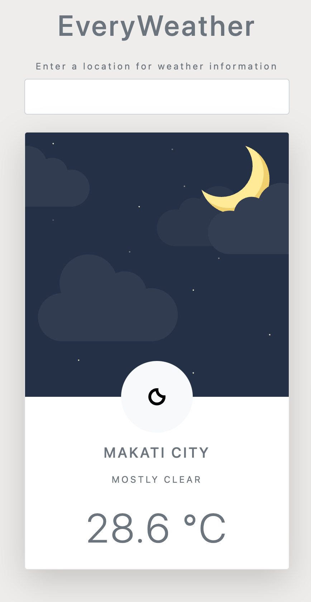

# everyWeather

Weather App

## Table of contents

- [Screenshot](#screenshot)
- [My process](#my-process)
  - [Built with](#built-with)
  - [What I learned](#what-i-learned)
  - [Continued development](#continued-development)
  - [Useful resources](#useful-resources)
- [Author](#author)

### Screenshot

## My process

### Built with

- Semantic HTML5 markup
- CSS
- Bootstrap
- Javascript

### What I learned

I learned how to use an API, and how async and await functions work.

### Continued development

I look forward to my future projects using async js and other API out there.

### Useful resources

- [AccuWeather API](https://developer.accuweather.com/apis) - This is the api I use to build this simple weather app.
- [MDN Async Documentation](https://developer.mozilla.org/en-US/docs/Web/JavaScript/Reference/Statements/async_function) - This is an amazing article which helped me finally understand Async JS. I'd recommend it to anyone still learning this concept.

## Author

- Website - [Jhonna Vhee F Gedalanga](https://www.2021portfolio.netlify.app)
- Twitter - [@grumpsofty](https://www.twitter.com/grumpsofty)
